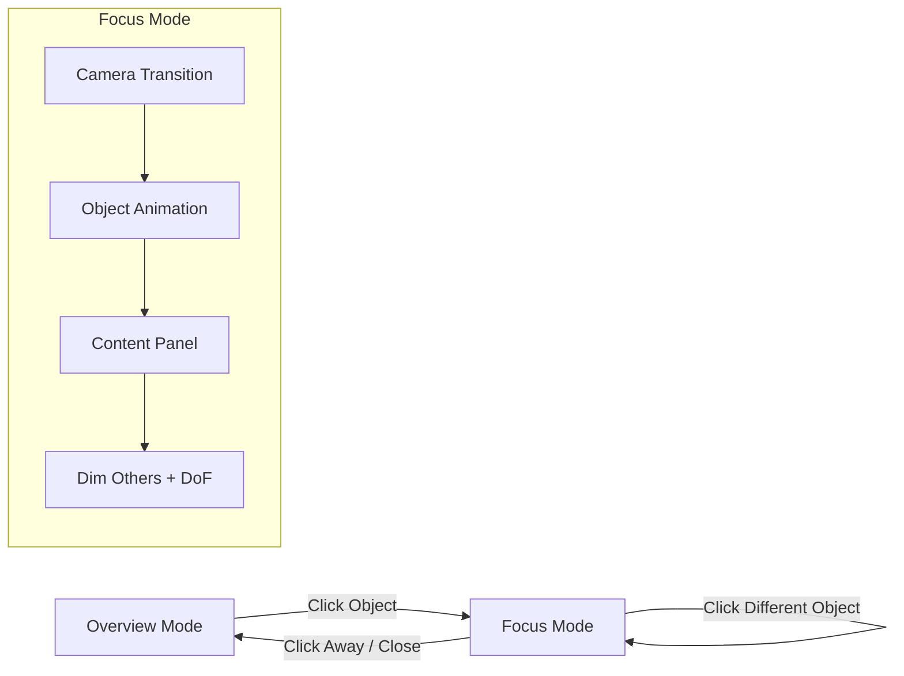

# Interactive 3D Resume Website

## Overview

A standalone 3D portfolio website presenting Vasilis Roumeliotis's resume as an interactive desk scene. A MacBook sits at the center as the main hub. Surrounding it are miniature objects — a toy train, medicine bottle, robot figurine, boxing gloves, and more — each representing a career chapter. Clicking an object triggers a cinematic camera fly-in, a playful object animation, and a content panel revealing the full story. The goal is an experience so smooth and polished it genuinely moves visitors.

## Problem Frame

Traditional PDF resumes are static and forgettable. As an AI Software Engineer pursuing roles in the AI/LLM space, a 3D interactive resume serves as both portfolio piece and technical proof-of-work — demonstrating React, Three.js, animation, and creative engineering skills in the artifact itself.

## Requirements Trace

- R1. MacBook at desk center serves as main hub showing name, summary, contact, and tech skills
- R2. Career objects around the desk represent specific work experiences with playful, recognizable iconography
- R3. Clicking an object triggers a smooth cinematic camera transition to focus on it
- R4. Each object plays a unique animation when selected (train moves, robot waves, etc.)
- R5. Content panels show full resume bullet points for each section
- R6. Dark atmospheric lighting with bloom, particles, and depth-of-field for emotional impact
- R7. Animations use damping (not tweening) for buttery-smooth, interruptible motion
- R8. Mobile-responsive with touch support
- R9. Deployed on Vercel
- R10. Loading experience that feels intentional, not broken

## Scope Boundaries

- No backend / no CMS — resume data is static TypeScript
- No sound/audio (can be added later as enhancement)
- No scroll-driven navigation — interaction is click-based exploration
- No gamification / collectibles — straightforward click-to-explore
- No contact form — links to email/LinkedIn/GitHub instead
- Single language (English)

## Context & Research

### Animation Philosophy (from award-winning portfolio research)

The consistent pattern across every top-tier 3D portfolio:

1. **Damping, not tweening** — use `maath/easing.damp` for all continuous motion. Values chase targets with exponential decay, inherently interruptible mid-flight
2. **Curated camera, not free orbit** — predefined cinematic camera positions, not OrbitControls. Constrained movement = film-like quality
3. **Asymmetric timing** — slow activation (0.4-0.6s), fast deselection (0.15s). Mimics physical inertia
4. **Layered subtlety** — 20 small things done perfectly > 1 big effect. Float + parallax + bloom + particles + DoF = atmosphere
5. **Restraint in effects** — bloom at 0.5-1.0 intensity, not maxed. Hint of depth of field. Subtle fog
6. **Mutable refs for animation, React state for intent** — useFrame mutates Three.js objects directly. React state only changes on discrete user decisions

### Key Technical Choices

- **`maath/easing`** over GSAP/react-spring for camera and object animations — frame-rate independent, interruptible, zero cleanup code
- **CameraControls (drei)** for programmatic `setLookAt()` transitions with built-in damping
- **HTML overlay panels outside Canvas** for content (not drei `<Html>`) — better scrolling, layout, and z-index behavior
- **Zustand** for state shared between 3D scene and DOM overlay
- **Pre-made GLTF models** from Sketchfab/Poly Pizza, optimized with `gltfjsx --transform`
- **`frameloop="demand"`** for on-demand rendering (mostly static scene, invalidate on interaction)

### Object-to-Section Mapping

| Object | Section | Animation on Select |
|--------|---------|-------------------|
| **MacBook** (center) | Name, Summary, Contact, Tech Skills | Screen lights up, typing animation on screen |
| **Toy train on tracks** (left) | Rail logistics — 30-60s → sub-second optimization | Train moves along short track loop |
| **Medicine bottle + capsules** (right) | Pharma — tariff system, 13 pay grades, 416+ tests | Bottle rotates, capsules float up |
| **Robot figurine** (left-back) | AI & Multi-Agent Systems — 9-agent platform, pricing engine, MCP servers | Robot head rotates, eyes glow |
| **Wrench + tablet** (right-back) | Enterprise Apps — HVAC offline PWA, pdf2zugferd, AI CRM | Wrench spins, tablet screen activates |
| **Boxing gloves** (far left) | Side Projects — ParkSpot, Arc, ABC, Deep Research | Gloves do a playful punch animation |
| **Globe** (far right) | Education + Languages — Democritus, Jupiter thesis, 4 languages | Globe spins to Greece, orbit particles appear |
| **Coffee mug** (ambient) | Not clickable — steam particles, atmosphere only | Continuous subtle steam |

## Key Technical Decisions

- **Curated camera positions over OrbitControls**: Free orbit feels like a tech demo. Fixed cinematic angles for each object feel like a film. Users can still slightly rotate/pan within constraints for tactile feedback
- **maath/easing.damp over GSAP/react-spring**: GSAP requires killing old tweens on re-target. Springs overshoot (wrong feel for camera). Damping redirects mid-flight with zero code, perfect for interruptible click sequences
- **Separate GLTF per object vs. single scene**: Separate models allow independent animations, easier iteration, and lazy loading. Trade-off is more HTTP requests, mitigated by preloading
- **Content panels as DOM overlays (not drei Html)**: Rich text panels with scrolling, links, and responsive layout work far better outside the WebGL context
- **Zustand over React context**: Need to read state inside useFrame without triggering re-renders (`getState()` pattern)

## Open Questions

### Resolved During Planning

- **Model sourcing**: Use free CC0/CC-BY models from Poly Pizza, Quaternius, and Sketchfab. Low-poly stylized aesthetic (not photorealistic) — fits the playful tone and performs better
- **Font for 3D text**: Use drei `<Text>` (SDF-based via troika) for crisp text at any distance. Name/title floating above MacBook
- **Camera constraints**: Allow subtle drag rotation (+-15 degrees azimuth, +-10 degrees polar) in overview mode for tactile feel, but snap back on release. Disable rotation entirely when focused on an object

### Deferred to Implementation

- **Exact model files**: Will source during implementation — depends on what's available with compatible licenses on Poly Pizza/Sketchfab
- **Object positions on desk**: Requires visual iteration in the 3D scene — positions in the config are starting points
- **Bloom threshold tuning**: Depends on actual material emissive values — tune visually
- **Mobile breakpoint for 3D layout**: Need to test whether objects should reposition or just scale down on mobile

## High-Level Technical Design

> *This illustrates the intended approach and is directional guidance for review, not implementation specification. The implementing agent should treat it as context, not code to reproduce.*

```
User clicks object
  → Zustand: setActiveObject('train')
  → Camera system reads new target from sceneConfig
  → maath/easing.damp smoothly moves camera to curated position (0.5s)
  → Object animation triggers (train moves along track)
  → Non-selected objects dim (opacity damps to 0.3)
  → DOM overlay panel slides in from right (Framer Motion)
  → Depth of field shifts focus to selected object

User clicks empty space / close button
  → Zustand: setActiveObject(null)
  → Camera damps back to overview position (0.15s — fast exit)
  → All objects restore full opacity
  → Panel slides out
  → Depth of field resets to overview
```



## Implementation Units

- [ ] **Unit 1: Project Scaffolding**

**Goal:** Create the new repo with Vite + React 19 + TypeScript + R3F ecosystem + Tailwind CSS + folder structure.

**Requirements:** R9

**Dependencies:** None

**Files:**
- Create: `package.json`
- Create: `vite.config.ts`
- Create: `tsconfig.json`
- Create: `tailwind.config.ts` (or CSS-based v4 config)
- Create: `src/main.tsx`
- Create: `src/App.tsx`
- Create: `src/vite-env.d.ts`
- Create: `index.html`
- Create: `vercel.json`
- Create: `.gitignore`
- Create: `CLAUDE.md`

**Approach:**
- Scaffold with `bun create vite@latest 3d-resume -- --template react-ts`
- Install: `three @types/three @react-three/fiber @react-three/drei @react-three/postprocessing postprocessing maath zustand framer-motion tailwindcss @tailwindcss/vite`
- Set up `@/` path alias in vite.config.ts and tsconfig.json
- `assetsInclude` for `.glb`, `.gltf`, `.hdr` in vite config
- Add `.glb` and `.gltf` module declarations in `vite-env.d.ts`
- Folder structure:
  ```
  src/
    components/
      canvas/          # 3D scene components
      overlay/         # DOM overlay panels
      ui/              # Shared UI primitives
    hooks/             # Custom hooks
    store/             # Zustand store
    data/              # Resume data + scene config
    models/            # Generated model components (from gltfjsx)
  public/
    models/            # Raw .glb files
    fonts/             # Typeface files
  ```
- `vercel.json` with SPA rewrite + model caching headers
- `CLAUDE.md` with project-specific commands and conventions

**Test expectation:** none — pure scaffolding

**Verification:**
- `bun dev` starts without errors
- Empty Canvas renders a colored background
- Tailwind classes work in a test element

---

- [ ] **Unit 2: Data Layer & State Management**

**Goal:** Define structured resume data, scene configuration (camera positions, object mappings), and Zustand store for app state.

**Requirements:** R1, R2, R5

**Dependencies:** Unit 1

**Files:**
- Create: `src/data/resume.ts`
- Create: `src/data/scene-config.ts`
- Create: `src/store/useAppStore.ts`

**Approach:**
- `resume.ts`: Export typed objects for each section — summary, contact, workExperience (grouped by theme: AI, Enterprise, Tooling), sideProjects, education, languages, techSkills. Each entry has full bullet points from the PDF
- `scene-config.ts`: Map of object keys to `{ position, cameraPosition, cameraTarget, label }`. These are starting values — will be tuned visually
- `useAppStore.ts`: Zustand store with:
  - `activeObject: string | null` — which object is focused
  - `isTransitioning: boolean` — camera in motion
  - `isLoaded: boolean` — all models loaded
  - `setActiveObject(key)` — triggers focus flow
  - `reset()` — returns to overview

**Patterns to follow:**
- Zustand vanilla store pattern (no providers, `getState()` for useFrame access)

**Test expectation:** none — pure data/config

**Verification:**
- All resume sections from the PDF are represented in typed data
- Store actions work correctly (set/reset active object)

---

- [ ] **Unit 3: Scene Foundation & Atmosphere**

**Goal:** Set up the 3D Canvas with dark atmospheric lighting, post-processing (bloom, vignette, depth of field), ambient particles, and fog.

**Requirements:** R6

**Dependencies:** Unit 1, Unit 2

**Files:**
- Create: `src/components/canvas/Scene.tsx`
- Create: `src/components/canvas/Lighting.tsx`
- Create: `src/components/canvas/Atmosphere.tsx`
- Create: `src/components/canvas/PostProcessing.tsx`
- Modify: `src/App.tsx`

**Approach:**
- `Scene.tsx`: Root scene component inside Canvas. Composes Lighting, Atmosphere, PostProcessing, and desk objects
- `Lighting.tsx`:
  - Dim ambient light (~0.15 intensity, cool blue tint)
  - Warm spot light as desk lamp (penumbra 0.8, casting shadows)
  - Cool blue point light for MacBook screen glow
  - Subtle accent point light from side
  - `<Environment preset="night" environmentIntensity={0.1} />` for reflections
  - `<ContactShadows>` for desk grounding
  - `<BakeShadows />` for static shadow baking
- `Atmosphere.tsx`:
  - drei `<Sparkles>` for floating dust particles (low count ~40, slow speed, warm color)
  - Subtle fog via scene fog or depth-buffer fog
- `PostProcessing.tsx`:
  - `<EffectComposer>` with Bloom (luminanceThreshold 0.6, intensity 0.8, mipmapBlur), Vignette (offset 0.3, darkness 0.9)
  - DepthOfField effect with dynamic focus distance (shifts to active object when focused)
  - Conditionally disable heavy effects on mobile via PerformanceMonitor
- Canvas setup: `dpr={[1, 2]}`, `frameloop="demand"`, `shadows`, `camera={{ position: [5, 4, 5], fov: 45 }}`
- `<PerformanceMonitor>` to adaptively reduce DPR and disable bloom on low FPS

**Patterns to follow:**
- `toneMapped={false}` on emissive materials for bloom pickup
- Contact shadows with `frames={1}` for single bake

**Test scenarios:**
- Happy path: Scene renders with visible desk lamp illumination and ambient glow
- Happy path: Bloom visible on emissive surfaces (MacBook screen)
- Happy path: Dust particles float gently in the scene
- Edge case: Performance degrades gracefully on low-end devices (bloom disabled, DPR drops)

**Verification:**
- Dark atmospheric scene visible with warm/cool lighting contrast
- Bloom glow on bright surfaces
- Particles floating in air
- Consistent 60fps on desktop

---

- [ ] **Unit 4: Desk & Object Models**

**Goal:** Source, optimize, and integrate 3D models for the desk and all interactive career objects. Each object is a separate component for independent animation.

**Requirements:** R2

**Dependencies:** Unit 1, Unit 3

**Files:**
- Create: `public/models/*.glb` (optimized model files)
- Create: `src/components/canvas/objects/Desk.tsx`
- Create: `src/components/canvas/objects/MacBook.tsx`
- Create: `src/components/canvas/objects/Train.tsx`
- Create: `src/components/canvas/objects/MedicineBottle.tsx`
- Create: `src/components/canvas/objects/Robot.tsx`
- Create: `src/components/canvas/objects/WrenchTablet.tsx`
- Create: `src/components/canvas/objects/BoxingGloves.tsx`
- Create: `src/components/canvas/objects/Globe.tsx`
- Create: `src/components/canvas/objects/CoffeeMug.tsx`
- Create: `src/components/canvas/DeskScene.tsx`

**Approach:**
- Source low-poly stylized models from Poly Pizza (CC0) and Sketchfab (CC-BY)
- Run each through `npx gltfjsx model.glb --transform --types --shadows` to generate optimized `.glb` + typed React component
- Keep total scene under 5MB compressed
- Each object component:
  - Loads its own GLTF with `useGLTF`
  - Preloads at module level with `useGLTF.preload()`
  - Accepts `onClick` and animation props
  - Has `dispose={null}` on root group
- `DeskScene.tsx`: Composes all objects at configured positions from `scene-config.ts`
- Desk surface receives shadows, objects cast shadows
- MacBook screen: plane with emissive material (`toneMapped={false}`) showing a gradient or code-like pattern
- Coffee mug: continuous steam particles via small `<Sparkles>` instance anchored above mug

**Patterns to follow:**
- gltfjsx generated component pattern with typed nodes/materials
- Separate model files for independent lazy loading

**Test scenarios:**
- Happy path: All objects render at correct positions on the desk
- Happy path: Models are optimized (total < 5MB)
- Edge case: Missing model file shows fallback geometry (colored box placeholder)

**Verification:**
- Full desk scene visible with all 8 objects
- Shadows grounding objects on desk surface
- MacBook screen glows with bloom
- Coffee steam particles visible

---

- [ ] **Unit 5: Interaction System & Camera Transitions**

**Goal:** Implement click/hover interactions on objects and smooth cinematic camera transitions using maath/easing.damp.

**Requirements:** R3, R4, R7

**Dependencies:** Unit 2, Unit 3, Unit 4

**Files:**
- Create: `src/hooks/useInteraction.ts`
- Create: `src/hooks/useCameraTransition.ts`
- Modify: `src/components/canvas/Scene.tsx`
- Modify: `src/components/canvas/DeskScene.tsx`
- Modify: `src/components/canvas/objects/*.tsx` (add interaction props)

**Approach:**
- **Camera system** (`useCameraTransition.ts`):
  - Use drei `<CameraControls>` with ref for programmatic `setLookAt()`
  - Read active object from Zustand store, look up camera target from scene-config
  - `smoothTime={0.5}` for focus transitions, faster for unfocus
  - Overview mode: allow slight drag rotation (+-15 deg azimuth, +-10 deg polar) for tactile feel
  - Focus mode: disable manual rotation, camera locked to curated angle
  - On `activeObject` change → `cameraControlsRef.current.setLookAt(...pos, ...target, true)`
- **Hover interactions** (`useInteraction.ts`):
  - `onPointerOver` → cursor: pointer, object scales to 1.05 via `easing.damp3`
  - `onPointerOut` → cursor: auto, scale damps back to 1.0
  - Disable hover on touch devices (`'ontouchstart' in window`)
  - Always `e.stopPropagation()` on pointer events
- **Click handling**:
  - `onClick` → `setActiveObject(objectKey)` in Zustand
  - `onPointerMissed` on Canvas → `reset()` (return to overview)
  - If clicking a different object while focused → redirect camera smoothly (damping handles this naturally)
- **Object dim/brighten**:
  - In useFrame: non-active objects damp opacity/scale toward dimmed state (scale 0.95, material opacity 0.3)
  - Active object damps to full brightness
  - Overview mode: all objects at full
- **Per-object select animations** (triggered when object becomes active):
  - Train: position damps along X axis in sine wave (moves on tracks)
  - Medicine: rotation damps on Y axis (spinning), capsule children float up via Y position damp
  - Robot: head child rotates, emissive intensity on eyes damps up
  - Wrench: rotation damp on Z axis (spinning)
  - Boxing gloves: alternating Y position (punching motion via sine)
  - Globe: Y rotation accelerates, particle ring appears
  - MacBook: screen emissive intensity damps up brighter

**Patterns to follow:**
- `easing.damp3` / `easing.damp` from `maath` in every useFrame — never snap values
- Asymmetric timing: 0.4-0.6 smoothTime for focus, 0.15 for unfocus
- Read Zustand with `getState()` inside useFrame, not React subscriptions

**Test scenarios:**
- Happy path: Click train → camera smoothly flies to train's curated angle
- Happy path: Click away → camera returns to overview
- Happy path: Click train while focused on robot → camera redirects smoothly to train (no jank)
- Happy path: Hover object → object subtly scales up, cursor changes
- Happy path: Selected object plays its unique animation
- Happy path: Non-selected objects dim when one is focused
- Edge case: Rapid clicking between objects doesn't break camera (damping handles mid-flight retarget)
- Edge case: Click on empty space while no object selected → nothing happens (already in overview)

**Verification:**
- Camera transitions feel cinematic and buttery smooth
- No snapping, popping, or jank in any transition
- Object animations are playful and recognizable
- Hover feedback is immediate but smooth

---

- [ ] **Unit 6: Content Overlay Panels**

**Goal:** Build HTML overlay panels that slide in when an object is selected, showing full resume content for that section.

**Requirements:** R1, R5

**Dependencies:** Unit 2, Unit 5

**Files:**
- Create: `src/components/overlay/ContentPanel.tsx`
- Create: `src/components/overlay/panels/SummaryPanel.tsx`
- Create: `src/components/overlay/panels/LogisticsPanel.tsx`
- Create: `src/components/overlay/panels/PharmaPanel.tsx`
- Create: `src/components/overlay/panels/AIPanel.tsx`
- Create: `src/components/overlay/panels/EnterprisePanel.tsx`
- Create: `src/components/overlay/panels/SideProjectsPanel.tsx`
- Create: `src/components/overlay/panels/EducationPanel.tsx`
- Create: `src/components/overlay/Navigation.tsx`
- Modify: `src/App.tsx`

**Approach:**
- Panels render **outside** Canvas as fixed-position DOM elements overlaid on the right side
- `ContentPanel.tsx`: Wrapper with Framer Motion `AnimatePresence` + `motion.div` for enter/exit animations
  - Enter: slide from right + fade in (0.4s, ease-out)
  - Exit: slide right + fade out (0.15s — fast exit, asymmetric timing)
- Each panel component renders its resume section from `resume.ts` data
  - Styled with Tailwind: dark semi-transparent background (`bg-black/80 backdrop-blur-xl`), light text, accent colors matching the object's glow color
  - Close button (X) in top right
  - Scrollable content area for long sections
  - Links to LinkedIn/GitHub/email are real `<a>` tags
- `Navigation.tsx`: Persistent name + title in top-left, subtle social links in top-right
  - Fades to reduced opacity when a panel is open (don't compete with content)
- Panel does not block Canvas pointer events outside its bounds (user can still click other objects or empty space to close)
- Each panel has a subtle accent color border/glow matching its object's emissive color (train=warm orange, pharma=green, AI=blue, etc.)

**Patterns to follow:**
- Framer Motion `AnimatePresence` with `mode="wait"` for clean transitions between panels
- `pointer-events-none` on panel container, `pointer-events-auto` on panel content (allow click-through to Canvas)

**Test scenarios:**
- Happy path: Click MacBook → summary panel slides in from right with name, contact, tech skills
- Happy path: Click train → logistics panel appears with full bullet points
- Happy path: Close panel → slides out quickly
- Happy path: Click different object while panel open → current panel exits, new one enters
- Happy path: Panel content is scrollable for long sections
- Edge case: Click empty Canvas space → panel closes
- Edge case: Panel links (email, LinkedIn, GitHub) are clickable and open in new tab

**Verification:**
- All 7 panels display complete resume content from the PDF
- Panel animations are smooth and feel connected to camera transitions
- No layout issues on various screen sizes
- Text is readable against the semi-transparent background

---

- [ ] **Unit 7: Loading Experience & Polish**

**Goal:** Create a loading screen, add idle animations, and polish micro-interactions for the "tears of joy" level of finish.

**Requirements:** R6, R7, R10

**Dependencies:** Unit 3, Unit 4, Unit 5, Unit 6

**Files:**
- Create: `src/components/overlay/LoadingScreen.tsx`
- Create: `src/hooks/useModelPreloader.ts`
- Modify: `src/components/canvas/objects/*.tsx` (idle animations)
- Modify: `src/components/canvas/Atmosphere.tsx` (enhanced particles)
- Modify: `src/App.tsx`

**Approach:**
- **Loading screen**:
  - Full-screen dark overlay with name "Vasilis Roumeliotis" and a minimal progress indicator
  - Uses `useProgress` from drei to track GLTF loading
  - Fades out with Framer Motion when all assets loaded (`isLoaded` in Zustand)
  - Delay the fade-out by ~0.5s after 100% to feel intentional, not jarring
- **Idle animations** (always running in overview mode):
  - All objects: gentle `<Float>` wrapper with low intensity (floatIntensity={0.3}, speed={1.5})
  - Coffee mug steam: continuous upward Sparkles
  - MacBook screen: subtle color shift on emissive (damp between two colors slowly)
  - Globe: very slow continuous Y rotation
- **Mouse-follow parallax**:
  - Entire desk scene group tilts very slightly toward cursor (+-2 degrees)
  - Use `state.pointer` in useFrame with `easing.dampE` for rotation
  - Creates depth and responsiveness without being distracting
- **Transition choreography refinement**:
  - When focusing: camera starts moving → 100ms delay → object animation starts → 200ms delay → panel slides in
  - Staggered timing prevents everything happening at once and creates perceived craftsmanship
- **Initial reveal**:
  - On first load complete: camera does a gentle zoom-in from further back + objects fade in with stagger
  - Sets the tone immediately

**Patterns to follow:**
- `drei/useProgress` for loading state
- Staggered timing via Zustand state + setTimeout (not animation library delays)
- `easing.dampE` for mouse parallax on scene rotation

**Test scenarios:**
- Happy path: Loading screen shows progress and fades out smoothly when complete
- Happy path: Objects gently float when idle in overview mode
- Happy path: Scene subtly tilts following mouse cursor
- Happy path: Focus transition has staggered choreography (camera → animation → panel)
- Happy path: Initial reveal animation plays on first load
- Edge case: Loading screen handles slow connections gracefully (doesn't flash)
- Edge case: Mouse parallax disabled on touch devices

**Verification:**
- Loading experience feels premium, not like a broken page
- Idle scene feels alive with subtle motion
- Mouse parallax adds depth without motion sickness
- Transition choreography feels crafted and intentional

---

- [ ] **Unit 8: Mobile, Performance & Deployment**

**Goal:** Ensure mobile responsiveness, optimize performance across devices, and deploy to Vercel.

**Requirements:** R8, R9

**Dependencies:** All previous units

**Files:**
- Create: `src/hooks/useResponsive.ts`
- Modify: `src/components/canvas/Scene.tsx` (responsive adjustments)
- Modify: `src/components/canvas/PostProcessing.tsx` (mobile optimization)
- Modify: `src/components/overlay/ContentPanel.tsx` (mobile layout)
- Modify: `src/components/overlay/Navigation.tsx` (mobile layout)
- Modify: `vercel.json`
- Create: `public/og-image.png` (social sharing image)
- Modify: `index.html` (meta tags, OG tags, favicon)

**Approach:**
- **Responsive 3D layout** (`useResponsive.ts`):
  - Use `useThree(s => s.viewport)` to detect screen size in 3D units
  - Mobile: scale desk scene down, pull camera back, increase FOV slightly
  - Objects may need repositioning — desktop has wide spread, mobile tighter grouping
- **Touch controls**:
  - CameraControls touch config: one-finger rotate, two-finger zoom
  - Disable hover effects on touch devices
  - Larger invisible hit-area meshes on mobile for easier tapping
- **Performance tiers** via `<PerformanceMonitor>`:
  - High: full bloom + vignette + DoF + particles + shadows (desktop)
  - Medium: bloom + vignette, no DoF, reduced particles (tablet)
  - Low: no post-processing, no shadows, reduced particle count (mobile)
- **Mobile panel layout**:
  - Panels slide up from bottom on mobile (not from right)
  - Max height 60vh with scroll
  - Larger close button / tap target
- **SEO & meta tags**:
  - Title: "Vasilis Roumeliotis — AI Software Engineer"
  - Description, OG image, Twitter card meta tags
  - Favicon
- **Vercel deployment**:
  - SPA rewrite: `"rewrites": [{ "source": "/(.*)", "destination": "/index.html" }]`
  - Model caching: `Cache-Control: public, max-age=31536000, immutable` for `/models/*`
  - Build command: `bun run build`

**Patterns to follow:**
- drei `<PerformanceMonitor>` with `onDecline`/`onIncline` callbacks
- Responsive breakpoints in 3D space via viewport width, not CSS media queries

**Test scenarios:**
- Happy path: Site renders and is interactive on iPhone Safari
- Happy path: Touch orbit works (single finger rotate, pinch zoom)
- Happy path: Panels display correctly on mobile (bottom sheet style)
- Happy path: Performance stays above 30fps on mid-range mobile
- Happy path: Deployed Vercel URL loads correctly with cached models
- Edge case: Very small screen (iPhone SE) — objects don't overlap, text readable
- Edge case: Slow 3G connection — loading screen shows progress, scene eventually loads
- Integration: OG meta tags render correct preview when URL shared on social media

**Verification:**
- Mobile experience is usable and still atmospheric
- Performance degrades gracefully across device tiers
- Vercel deployment accessible at production URL
- Social sharing preview looks good

## System-Wide Impact

- **Interaction graph:** Click event → Zustand store → Camera transition (useFrame) + Object animation (useFrame) + Panel overlay (React state via Zustand subscription). All mediated through single Zustand store
- **Error propagation:** Model loading failures should show placeholder geometry, not crash the scene. Wrap model components in error boundaries
- **State lifecycle risks:** Rapid clicking could queue conflicting camera targets — mitigated by damping (naturally handles retargeting). Panel AnimatePresence handles exit/enter sequencing
- **Integration coverage:** Camera + animation + panel choreography must feel unified — test the full click→focus→panel flow as one integrated interaction, not three separate features

## Risks & Dependencies

| Risk | Mitigation |
|------|------------|
| Model sourcing: may not find perfect CC0 models for all objects | Fallback to simple stylized geometry (rounded boxes with icons). Low-poly aesthetic is forgiving |
| Performance on mobile Safari | PerformanceMonitor adaptive quality. Test on real iPhone early. Budget: <100K triangles, <3 lights |
| Scene layout requires visual iteration | Positions in scene-config are starting points. Plan for iteration time adjusting positions, camera angles, lighting |
| GLTF loading time on slow connections | Preload critical models, progressive loading, meaningful loading screen |
| R3F v9 + React 19 compatibility edge cases | Pin exact versions. drei 10.7+ and fiber 9.5+ are stable with React 19 |

## Sources & References

- R3F docs: r3f.docs.pmnd.rs
- drei docs: drei.docs.pmnd.rs
- maath easing: github.com/pmndrs/maath
- gltfjsx: github.com/pmndrs/gltfjsx
- Poly Pizza (CC0 models): poly.pizza
- Codrops 3D product grid (Feb 2026): damping + asymmetric timing patterns
- Bruno Simon portfolio: open-source reference for atmospheric 3D scenes
- camera-controls library: programmatic setLookAt transitions
